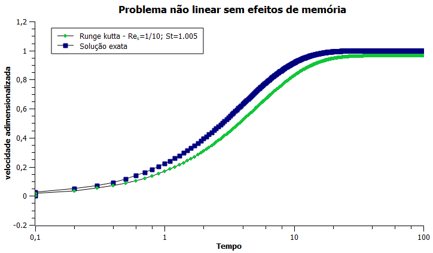
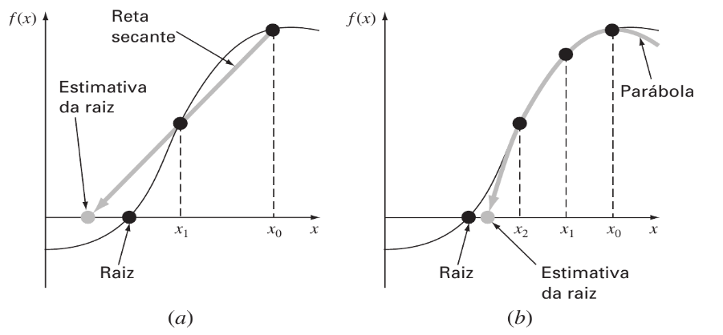
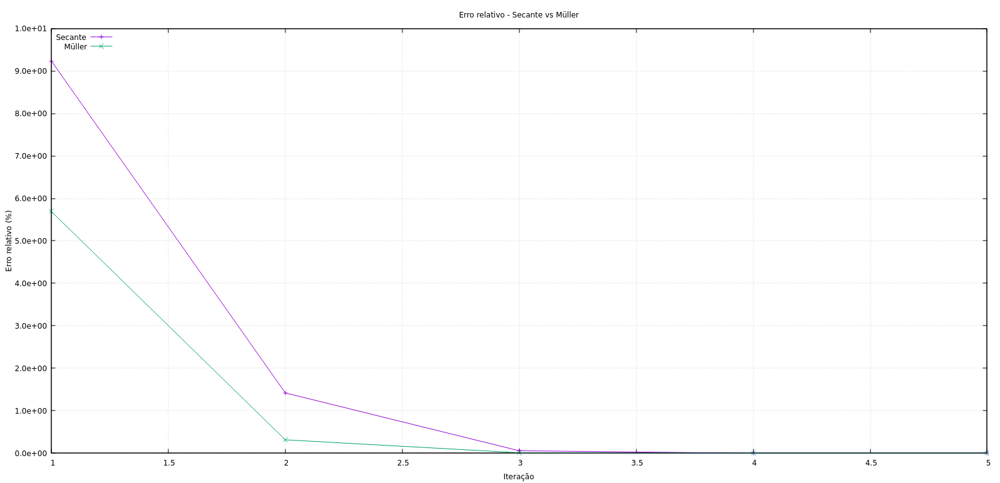
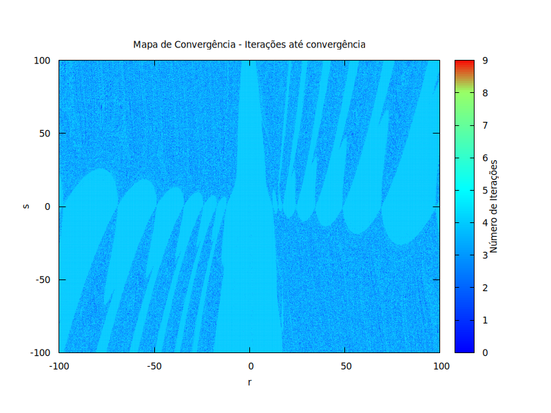
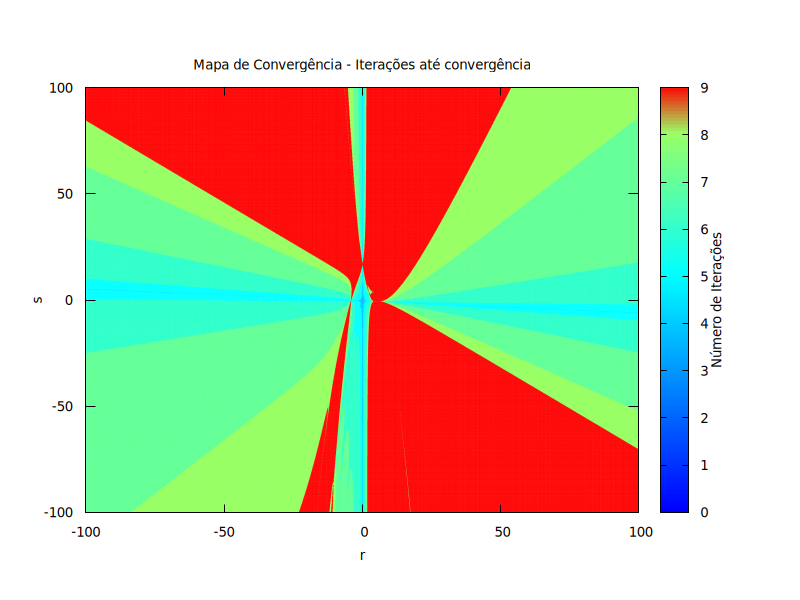

# Numerical Methods Repository - André Brandão

<p align="center">
  
</p>

This repository serves as a collection of all the Fortran codes I wrote during the Numerical Methods course in Mechanical Sciences.  
Below is an overview of the folder structure and explanations for each code located in the [codes folder](./codes).

Additionally, the [Analysis](./Analysis) folder contains PDF files with analyses performed using some of the developed codes.

---

## Code 1 - 4th Order Runge-Kutta Method

This code studies a sphere sedimenting in a fluid. Considering the drag force, Newton’s second law applied to this problem reads:

$$
m_p \frac{dv_z}{dt} = -6\pi \eta a v_z - \frac{9}{4} \pi \rho_r a^2 v_z^2 + \frac{4}{3} \pi a^3 \Delta \rho g
$$

Or in its dimensionless form:

$$
St \frac{dv_z^{\ast}}{dt^{\ast}} = -v_z^{\ast} - \frac{3}{8} Re_s (v_z^{\ast})^{2} + 1
$$

The drag-free version is:

$$
St \frac{dv_z^{\ast}}{dt^{\ast}} = 1 - v_z^{\ast}
$$

This code calculates the velocity of the sphere during sedimentation using the 4th order Runge-Kutta method.

The core part of the implementation is shown below:

```fortran
do i = 1, n  ! Iterate over time steps
    call rk4(v_star, t_star, dt, St)
    t_star = t_star + dt  ! Advance in time
end do

function dvdt(v, St) result(dv)
    real(8), intent(in) :: v, St
    real(8) :: dv
    real(8) :: Re_s
    Re_s = 0.001
    ! Functions to consider
    ! dv = (1.0d0 - v) / St
    dv = (1 - v - (3.0/8.0)*Re_s*v**2) / St
end function dvdt

subroutine rk4(v, t, dt, St)
    real(8), intent(inout) :: v  ! dimensionless velocity
    real(8), intent(in) :: t, dt, St
    real(8) :: k1, k2, k3, k4

    k1 = dt * dvdt(v, St)
    k2 = dt * dvdt(v + 0.5d0 * k1, St)
    k3 = dt * dvdt(v + 0.5d0 * k2, St)
    k4 = dt * dvdt(v + k3, St)

    v = v + (k1 + 2.0d0*k2 + 2.0d0*k3 + k4) / 6.0d0
end subroutine rk4
```

An example comparison between this numerical method and the analytical result is shown below:

  
*Figure 1 – Temporal development of the dimensionless velocity for \( St=1.005 \).*

### How to use

Compile the program with:

```bash
ifx program_1.f90
```

and run the executable:

```bash
./a.out
```

---

## Code 2 - Bisection and False Position Methods

These numerical methods find the root (zero) of functions. Both have advantages and drawbacks. They are based on narrowing an initial interval that contains the root.

In the **bisection method**, the interval is halved each iteration. Given lower bound $(x_l\)$ and upper bound $(x_u\)$, the midpoint is:

$$
x_m = \frac{x_l + x_u}{2}
$$

If $(f(x_m) \times f(x_l) \leq 0\)$, then the root lies between $(x_l\)$ and $\(x_m)$, so update $(x_u = x_m)$; otherwise, update $(x_l = x_m\)$. Repeat until the desired tolerance is reached.

The **false position method** takes into account the function values at the interval ends to better approximate the root:

$$
x_m = x_u - \frac{f(x_u) \cdot (x_l - x_u)}{f(x_l) - f(x_u)}
$$

Then the interval is updated similarly based on the sign of $(f(x_m) \times f(x_l))$.

### How to use

Compile:

```bash
ifx program_2.f90
```

Run:

```bash
./a.out
```

---

## Code 3 - Secant and Müller Methods

This program compares the Secant and Müller methods for root finding of a given polynomial. The comparison is based on the relative error (%) at each iteration until the desired tolerance is met.

The **Secant method** approximates the root using two previous points:

$$
x_{i+1} = x_i - \frac{f(x_i) \cdot (x_{i-1} - x_i)}{f(x_{i-1}) - f(x_i)}
$$

The **Müller method** fits a parabola through three points and approximates the root by:

$$
x_{i+1} = x_i - \frac{2c}{b \pm \sqrt{b^2 - 4ac}}
$$

where:

$$
a = \frac{\delta_1 - \delta_0}{h_1 - h_0}, \quad b = a h_1 + \delta_1, \quad c = f(x_2)
$$

and

$$
h_0 = x_1 - x_0, \quad h_1 = x_2 - x_1, \quad \delta_0 = \frac{f(x_1) - f(x_0)}{x_1 - x_0}, \quad \delta_1 = \frac{f(x_2) - f(x_1)}{x_2 - x_1}
$$

Comparison plot:

  
*Figure 2 – Comparison between the Secant and Müller methods.*

### How to use

Compile:

```bash
ifx program_3.f90
```

Run:

```bash
./a.out
```

The file `grafico.plt` contains gnuplot commands to plot "Relative error (%) vs iteration". You need gnuplot installed.

Output example:

  
*Figure 3 – Relative error vs iteration.*

---

## Code 4 - Bairstow's Method

This program implements Bairstow’s method to find roots of any polynomial by dividing it by a quadratic polynomial:

$$
f(x) = x^2 - r x - s
$$

The method iteratively adjusts $\(r\)$ and $\(s\)$ using Newton-Raphson until the remainder is zero.

Each quadratic factor corresponds to one or two roots (including complex conjugates). The polynomial is deflated by dividing out this factor and the process repeats until all roots are found.

Since convergence depends on initial guesses for $\(r\)$ and $\(s\)$, this program can generate fractal maps visualizing convergence over ranges of $\(r\)$ and $\(s\)$.

A fractal map is a colorful image where each pixel corresponds to an initial guess $\((r,s)\)$, colored by the number of iterations to converge. Non-convergent points are black.

Examples:

<p align="center">
  
  
</p>

*Figure 4 – Example fractal maps for 3rd and 5th degree polynomials.*

### How to use

Compile:

```bash
ifx program_4.f90
```

Run:

```bash
./a.out
```

The program will ask for polynomial coefficients, initial guesses for $\(r\)$ and $\(s\)$, and a range for fractal generation.

The gnuplot script `mapa.gnu` plots the fractal map. After generating `mapa.dat`, run:

```bash
gnuplot -persist mapa.gnu
```

Make sure to adjust `set xrange` and `set yrange` in `mapa.gnu` if you change the fractal range.

---

## Code 5 - Linear Systems Solutions

Two programs solve two different problems.

The first code [code 5.1](./codes/program%205/program5.f90) solves a 5x5 system that arises from studying concentrations in interconnected reactors. Based on input concentrations and flow rates, it calculates the output concentrations.

This system is solved using LU decomposition. The coefficient matrix $\( \mathbf{A} \)$ is decomposed into:

$$
\mathbf{A} = \mathbf{L} \mathbf{U}
$$

where $\(\mathbf{L}\)$ is lower triangular and $\(\mathbf{U}\)$ is upper triangular. Then the following systems are solved in order:

$$
\mathbf{L} \cdot \mathbf{d} = \mathbf{b}
$$

$$
\mathbf{U} \cdot \mathbf{x} = \mathbf{d}
$$

### How to use

Compile:

```bash
ifx program_5.f90
```

Run:

```bash
./a.out
```
